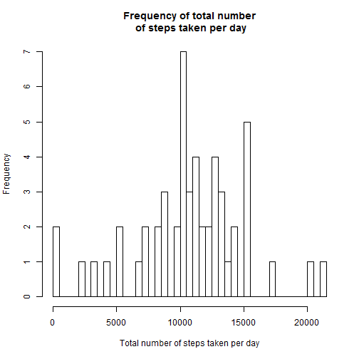
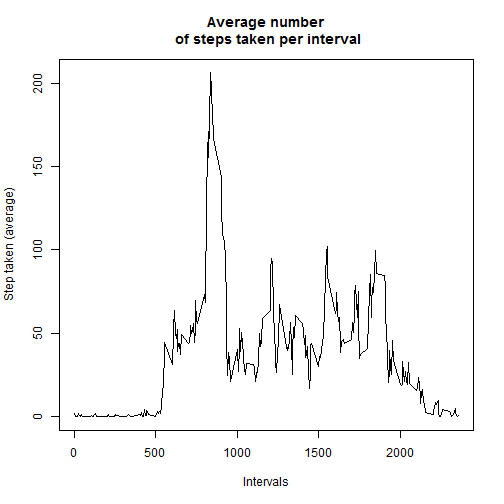
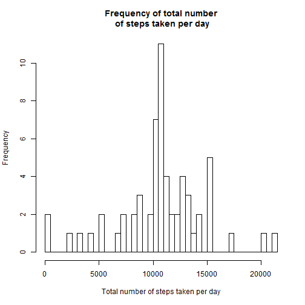
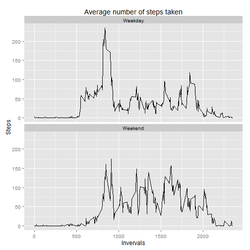

### Loading, preprocessing the data, load relevant libraries  


The data is downloaded and unziped using R Studio:


```r
unzip("repdata_data_activity.zip")
```

```
## Warning in unzip("repdata_data_activity.zip"): error 1 in extracting from
## zip file
```

The data was read grouped by 'date' using dplyr:

```r
d<-read.csv("activity.csv", colClasses = c("numeric", "Date", "numeric"))
d2<-d[complete.cases(d), ]
library(dplyr) 	
d2<- tbl_df(d2)
d3<-select(d2, date, steps)
d3<-group_by(d3, date)
```
### What is mean total number of steps taken per day?
1.Calculate the total number of steps taken per day

```r
total_steps<-summarise_each(d3, funs(sum)) 
head(total_steps,10)
```

```
## Source: local data frame [10 x 2]
## 
##          date steps
## 1  2012-10-02   126
## 2  2012-10-03 11352
## 3  2012-10-04 12116
## 4  2012-10-05 13294
## 5  2012-10-06 15420
## 6  2012-10-07 11015
## 7  2012-10-09 12811
## 8  2012-10-10  9900
## 9  2012-10-11 10304
## 10 2012-10-12 17382
```
2.Make a histogram of the total number of steps taken each day

```r
hist(total_steps$steps, main="Frequency of total number\n of steps taken per day", xlab="Total number of steps taken per day", breaks=50)		
```

 

3.Calculate and report the mean and median of the total number of steps taken per day

```r
mean<-mean(total_steps$steps)			
median<-median(total_steps$steps)
```
The mean is 10766.1887, and the median is 10765.0000.

### What is the average daily activity pattern?
1.Make a time series plot (i.e. type = "l") of the 5-minute interval (x-axis) and the average number of steps taken, averaged across all days (y-axis)

```r
d4<-group_by(d2, interval)
average_interval<-summarise_each(d4, funs(mean))
plot(average_interval$interval, average_interval$steps, main="Average number\n of steps taken per interval", xlab="Intervals", ylab="Step taken (average)",type="l")	
```

 

2.Which 5-minute interval, on average across all the days in the dataset, contains the maximum number of steps?

```r
max_step<- filter(average_interval,steps==max(average_interval$steps))
max_step$interval
```

```
## [1] 835
```
Maximal number of steps was taken at interval 835.

### Imputing missing values
1.Calculate and report the total number of missing values in the dataset (i.e. the total number of rows with NAs)

```r
sum(is.na(d))	
```

```
## [1] 2304
```
2.Devise a strategy for filling in all of the missing values in the dataset. 

The average step taken at at corresponding interval will be used impute the missing values. Imputing data will be perform using 'plyr' library.

```r
library(plyr)
impute.mean <- function(x) replace(x, is.na(x), mean(x, na.rm = TRUE))
d_impute <- ddply(d, ~ interval, transform, steps = impute.mean(steps))
```
3.Create a new dataset that is equal to the original dataset but with the missing data filled in.

```r
head(d_impute, 10)
```

```
##        steps       date interval
## 1   1.716981 2012-10-01        0
## 2   0.000000 2012-10-02        0
## 3   0.000000 2012-10-03        0
## 4  47.000000 2012-10-04        0
## 5   0.000000 2012-10-05        0
## 6   0.000000 2012-10-06        0
## 7   0.000000 2012-10-07        0
## 8   1.716981 2012-10-08        0
## 9   0.000000 2012-10-09        0
## 10 34.000000 2012-10-10        0
```

4.Make a histogram of the total number of steps taken each day and Calculate and report the mean and median total number of steps taken per day. Do these values differ from the estimates from the first part of the assignment? What is the impact of imputing missing data on the estimates of the total daily number of steps?

```r
d2_impute<- tbl_df(d_impute)
d3_impute<-select(d2_impute, date, steps)
d3_impute<-group_by(d3_impute, date)

total_steps_impute<-summarise_each(d3_impute, funs(sum)) 
hist(total_steps_impute$steps, main="Frequency of total number\n of steps taken per day", xlab="Total number of steps taken per day", breaks=50)	
```

 

The mean and median of the data with imputed value are computed as below:

```r
mean_impute<-mean(total_steps_impute$steps)		
median_impute<-median(total_steps_impute$steps)	
```
The mean and median of imputed data are 10766.1887, and 10766.1887, respectively.
The mean and median of data with missing values are 10766.1887, and the median is 10765.0000, respectively. Thus, there is very little difference between these parameters in the two data sets.

### Are there differences in activity patterns between weekdays and weekends?
1.Create a new factor variable in the dataset with two levels - "weekday" and "weekend" indicating whether a given date is a weekday or weekend day.


```r
d2_weekdays<-mutate(d2, Weekdays = factor((weekdays(date)=="Saturday" | weekdays(date)=="Sunday"), labels=c("Weekday", "Weekend")))
```
2.Make a panel plot containing a time series plot (i.e. type = "l") of the 5-minute interval (x-axis) and the average number of steps taken, averaged across all weekday days or weekend days (y-axis). 


```r
d4_weekdays<-group_by(d2_weekdays, interval, Weekdays)
avg_interval_weekdays<-summarise_each(d4_weekdays, funs(mean))

library(ggplot2)
g<-ggplot(avg_interval_weekdays, aes(interval, steps))	
g + geom_line() + facet_grid(. ~Weekdays)+facet_wrap(~ Weekdays, ncol=1)+xlab("Invervals")+ylab("Steps")+ggtitle("Average number of steps taken")  
```

 

There is more movement on weekends.


